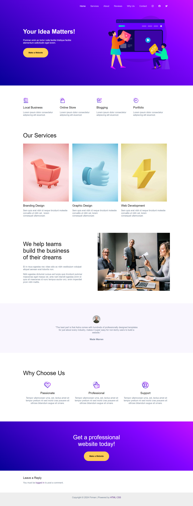

# Layout
Layout web ini umumnya memiliki header dengan menu navigasi di bagian atas dan bagian utama yang menampilkan teks ajakan, seperti "Your Idea Matters!", dengan tombol aksi yang mencolok. Meskipun tampilannya bervariasi, elemen-elemen inti seperti teks utama, tombol aksi, ilustrasi di sisi kanan, serta penggunaan gradasi warna pada latar belakang tetap menjadi ciri khas dari setiap layout. 
